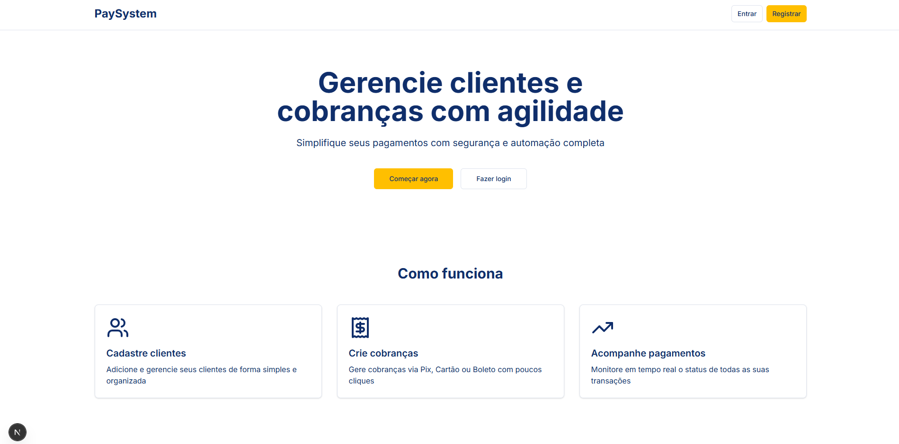

# 💳 Colmeia Pagamentos Frontend




Front-end da aplicação **Colmeia Pagamentos**, construído em **Next.js** com **TypeScript**, focado em integração com a **API Colmeia Pagamentos**.

O sistema utiliza **Radix UI** para componentes acessíveis, **TailwindCSS** para estilização moderna, Context API com arquitetura **MVVM** para controle de estado, e **Framer Motion** para animações fluidas.

## 🚀 Tecnologias

| Categoria | Tecnologia |
| | |
| **Framework** | Next.js |
| **Linguagem** | TypeScript + React |
| **UI Library** | Radix UI + TailwindCSS |
| **Gestão de estado assíncrono** | Context Api (MVVM) |
| **Formulários** | React Hook Form + Zod |


## ⚠️ Status do Projeto
🔧 O frontend ainda está em desenvolvimento, mas já é possível testar fluxos principais do sistema, incluindo:
- Cadastro de novos clientes (CRUD completo)
- Criação de cobranças vinculadas a clientes
- Acesso e operações apenas com usuários admin pré-criados

## ⚙️ Pré-requisitos

- Node.js >= 20
- [npm](https://www.npmjs.com/) ou yarn
- API backend da **Colmeia Pagamentos** rodando localmente ou em ambiente acessível

No diretório do front-end, você pode rodar:

```bash
npm i
npm run dev
```

## 🐣 Rodando o Frontend

1. Clone o repositório:

```bash
git clone https://github.com/AndersonAlvesCoelho/colmeia-payment
cd colmeia-payment
```

1. Instale as dependências:

```bash
npm install
```

1. Crie um arquivo `.env.local` com a URL da API:

```
NEXT_PUBLIC_API_URL=http://localhost:8080/api/v1
```

1. Rode em modo desenvolvimento:

```bash
npm run dev
```

O frontend estará disponível em:

> 📍 http://localhost:3000


## 🔄 Integração com o Backend

A aplicação consome todos os endpoints do **Colmeia Pagamentos API**, incluindo:

- **Clientes** → `/api/v1/customer`
- **Cobranças** → `/api/v1/charges`
- **Autenticação** → `/api/v1/auth`
- **Auditoria / Logs** → `/api/v1/audit/logs`

> Certifique-se de que a API back-end está rodando em http://localhost:8080 ou ajuste a variável NEXT_PUBLIC_API_URL.

> 🔗 [Repositório Backend](https://github.com/AndersonAlvesCoelho/api-payment-colmeia)


## 📝 Observações
- Este repositório contém somente o front-end da aplicação.
- O foco atual está em clientes e cobranças (CRUD).
- Novas telas e módulos (como dashboard e relatórios) estão em desenvolvimento.
- O sistema foi projetado para integração direta com a Colmeia Pagamentos API.